🛍️ RetailPulse – End-to-End Retail Analytics Pipeline

A full-stack Retail Analytics Platform built using FastAPI (Python), React, and deployed on Render + Vercel.

This project simulates a real-world retail analytics system that processes transaction data and generates advanced business insights including RFM segmentation, CLV analysis, forecasting, KPI dashboards, and automated exports.

🚀 Live Demo

🔗 Frontend (Vercel):
https://retail-analytics-pipeline.vercel.app

🔗 Backend API (Render):
https://retail-analytics-pipeline.onrender.com

📌 Project Overview

RetailPulse is designed to:

Upload retail transaction datasets (CSV / Excel)

Validate required schema

Run a 12-step analytics pipeline

Generate business KPIs

Perform customer segmentation

Forecast sales

Export cleaned and processed datasets

Generate HTML reports

This mimics a real-world data analytics workflow used in retail businesses.

🏗️ Architecture
React (Frontend - Vercel)
        ↓
FastAPI (Backend - Render)
        ↓
Analytics Engine (Pandas, ML, Forecasting)
🛠️ Tech Stack
🔹 Frontend

React.js

Axios

Tailwind CSS

ShadCN UI

Vercel Deployment

🔹 Backend

FastAPI

Pandas

NumPy

Scikit-learn (Clustering)

Statsmodels (Forecasting)

Uvicorn

Docker

Render Deployment

🔹 Analytics Modules

Data Ingestion

Data Cleaning

Feature Engineering

Exploratory Data Analysis (EDA)

RFM Analysis

K-Means Customer Segmentation

Customer Lifetime Value (CLV)

KPI Generation

Performance Analysis

Sales Forecasting

Report Generator

📊 Key Features
📁 Dataset Management

Upload CSV or Excel files

Schema validation

Activate multiple datasets

File size + row count preview

⚙️ 12-Step Automated Pipeline

End-to-end analytics execution

Real-time status tracking

Stage-wise progress updates

📈 Business Intelligence

Revenue KPIs

Top customers & products

Monthly performance

Country/category analysis

👥 Customer Segmentation

RFM scoring

K-Means clustering

Segment distribution

💰 Customer Lifetime Value (CLV)

CLV calculation

At-risk customer detection

High-value customer analysis

🔮 Forecasting

Time series forecasting

Seasonal trend analysis

Model comparison

📤 Export System

Export cleaned data

Export RFM / Segments / CLV

Generate downloadable reports

📂 Project Structure
Retail_Analytics_Pipeline/
│
├── backend/
│   ├── analytics/
│   ├── data/
│   ├── outputs/
│   ├── server.py
│   ├── Dockerfile
│   └── requirements.txt
│
├── frontend/
│   ├── src/
│   ├── components/
│   └── pages/
│
└── README.md
🔄 How the Pipeline Works

Upload dataset

Validate schema

Clean & preprocess data

Generate KPIs

Perform EDA

Compute RFM scores

Run K-Means clustering

Calculate CLV

Analyze performance metrics

Forecast sales

Cache results

Generate export/report

🧪 Example Dataset Requirements

Required columns:

transaction_id

quantity

transaction_date

price

customer_id

transaction_amount

⚡ Deployment Details
Frontend

Hosted on Vercel

Uses environment variable:

REACT_APP_API_URL=https://retail-analytics-pipeline.onrender.com/api
Backend

Hosted on Render (Docker-based deployment)

CORS configured for Vercel frontend

Supports large dataset processing (optimized for demo scale)

⚠️ Known Limitations

Large datasets (>500k rows) may require higher memory tier on Render

Forecasting stage is computationally intensive

Free tier services may experience cold start delay

🎯 Use Case

This project demonstrates:

Real-world data pipeline architecture

Backend API design using FastAPI

Frontend-backend integration

Cloud deployment

Scalable analytics workflow

Data engineering + analytics engineering skills

📸 Screenshots

### 📊 Dashboard

### ⚙️ Pipeline Execution
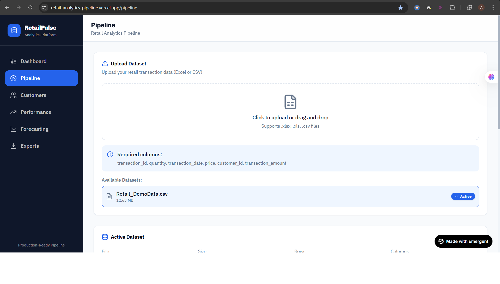
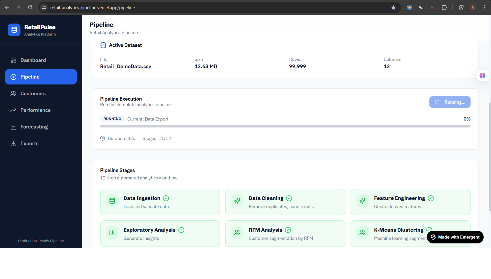
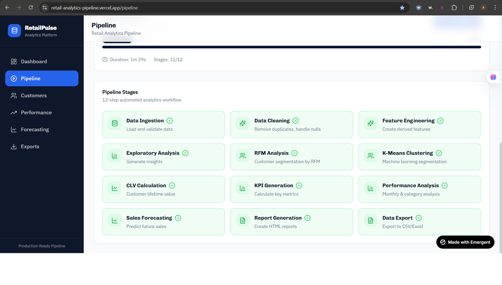

### 👥 Customer Segmentation

### 👥 Performance
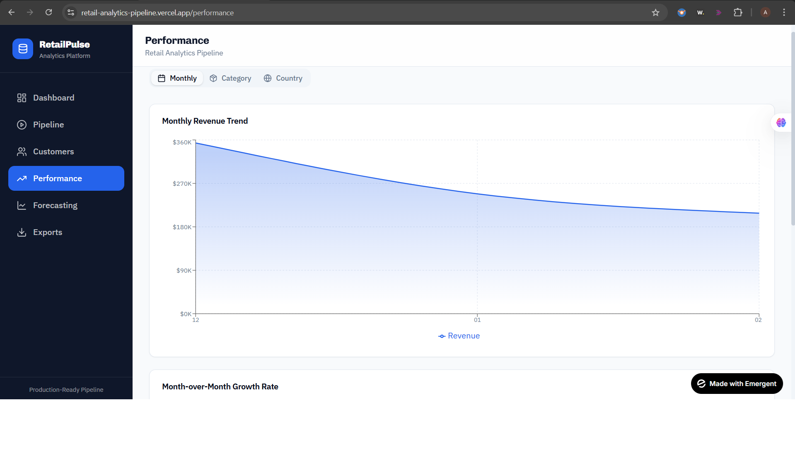
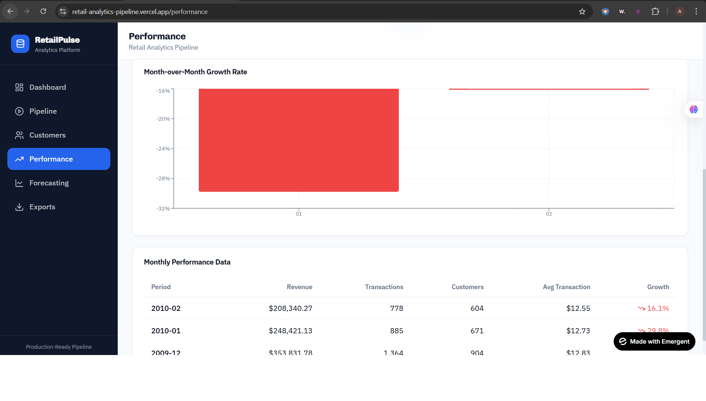
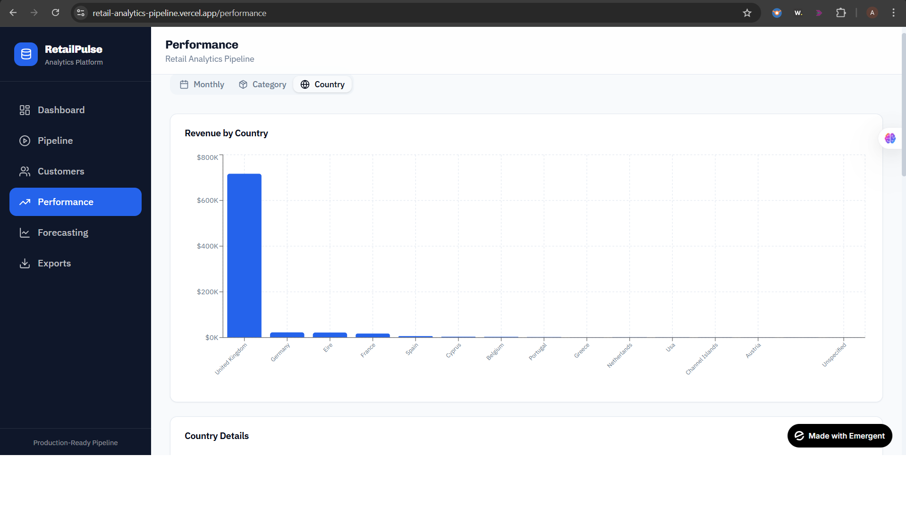
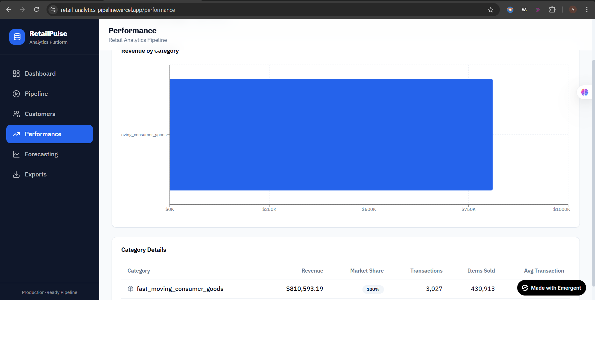

### 🔮 Sales Forecasting

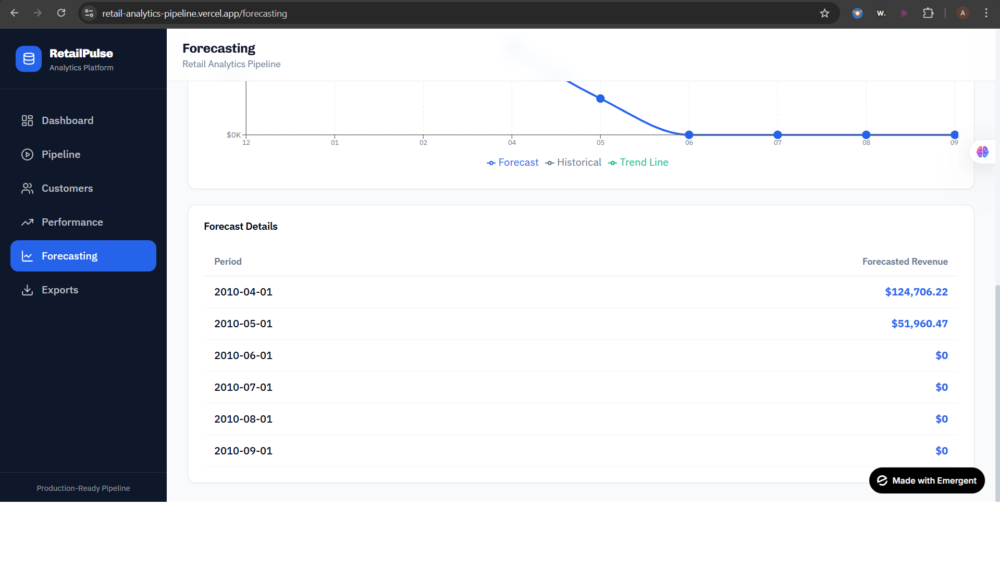

### 🔮 Exports
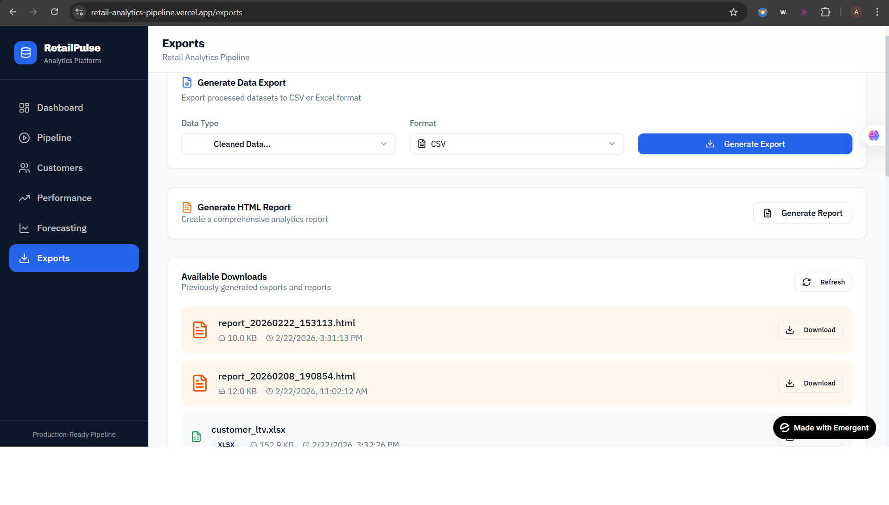
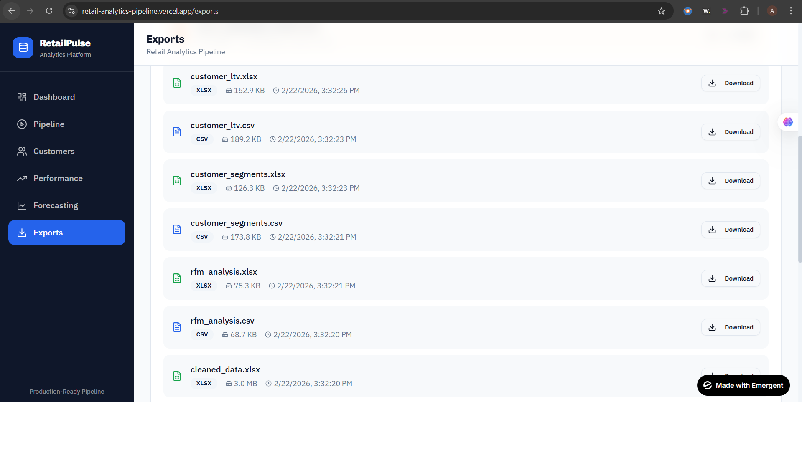
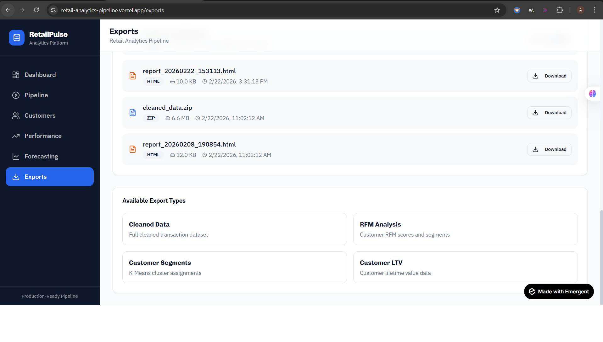

👨‍💻 Author

Arnab Mondal
Data Analyst | SQL | Python | Power BI | Data Engineering |

📧 arnabmondal0407@gmail.com

🔗 LinkedIn: https://www.linkedin.com/in/arnab-mondal-108966244

💻 GitHub: https://github.com/ArnabMondal98
