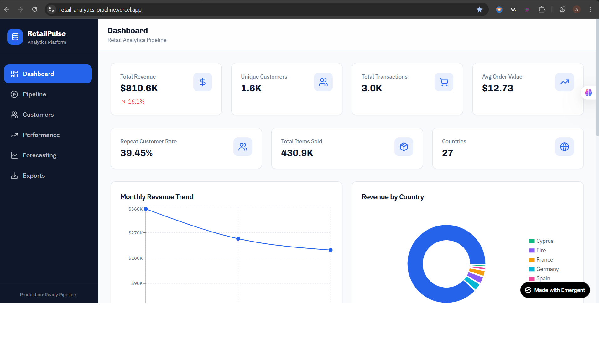
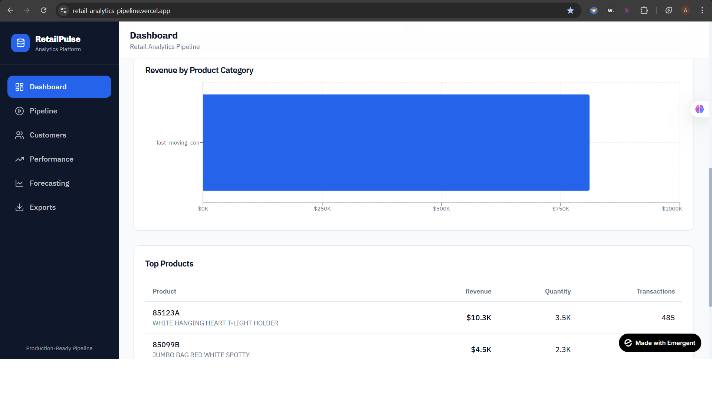
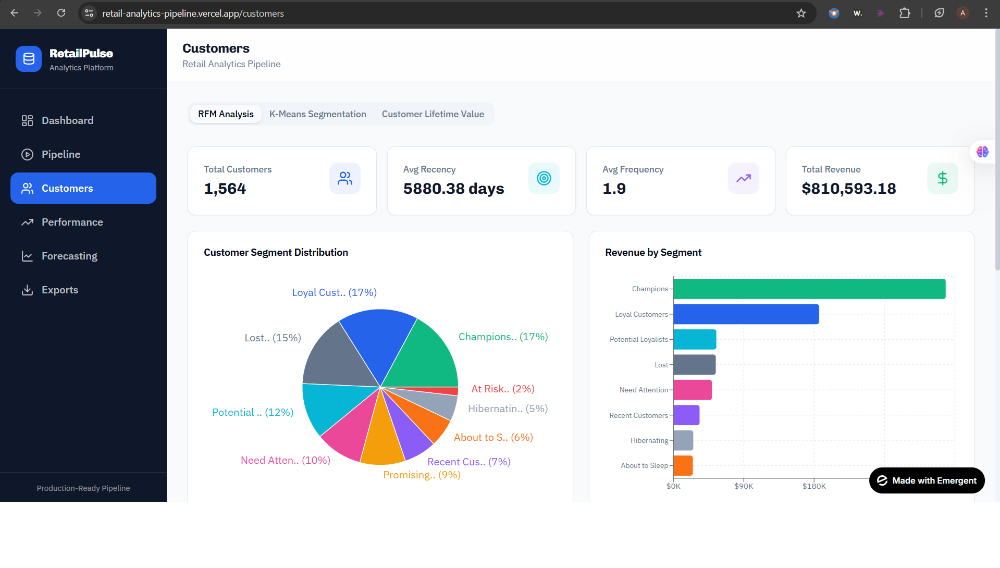
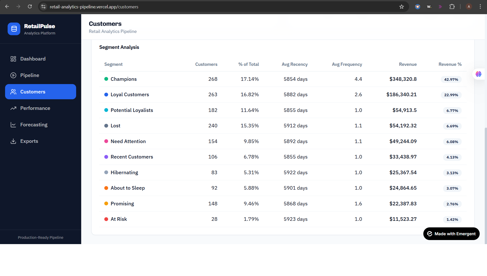
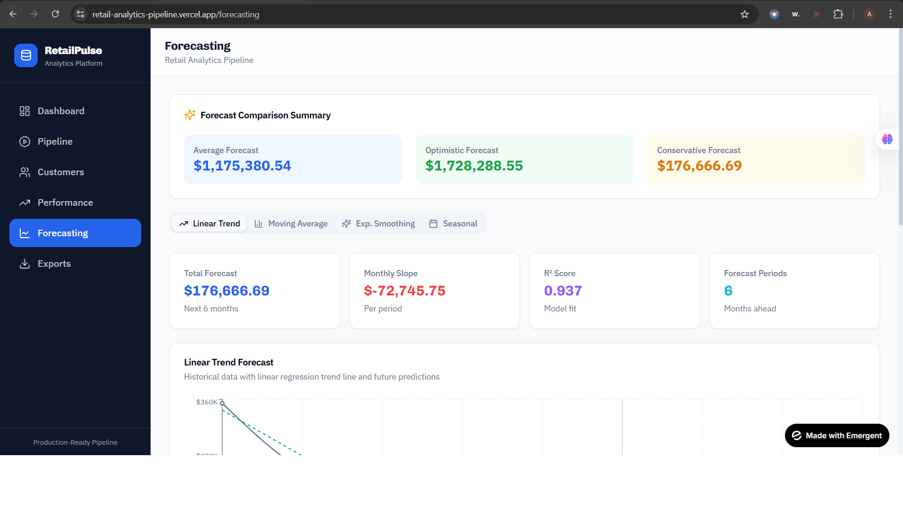
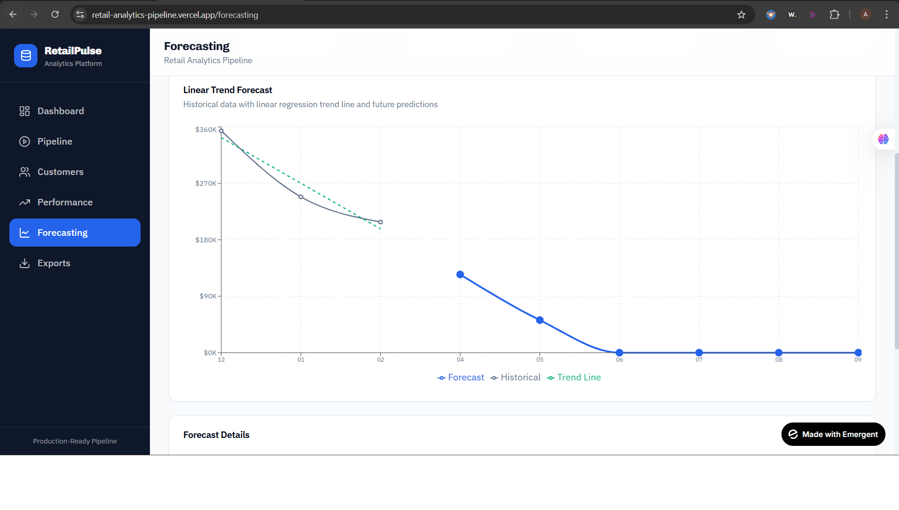

🛍️ RetailPulse
End-to-End Retail Analytics Platform | FastAPI + React + ML + Cloud Deployment

  

A production-style full-stack Retail Analytics Platform that processes transactional data and generates advanced business intelligence insights including RFM segmentation, customer clustering, KPI dashboards, CLV modeling, and sales forecasting.

Deployed live using FastAPI (Render) + React (Vercel).

🚀 Live Demo

🔗 Frontend: https://retail-analytics-pipeline.vercel.app

🔗 Backend API: https://retail-analytics-pipeline.onrender.com

💻 GitHub Repository: https://github.com/ArnabMondal98/Retail_Analytics_Pipeline

📌 Project Overview

RetailPulse simulates a real-world retail analytics system used by data teams to:

Ingest retail transaction datasets (CSV / Excel)

Validate schema & data quality

Execute a 12-stage analytics pipeline

Generate KPIs & dashboards

Perform customer segmentation

Calculate Customer Lifetime Value (CLV)

Forecast sales trends

Export analytical outputs

Generate HTML reports

This project demonstrates both Data Analytics + Backend Engineering + Cloud Deployment capabilities.

🏗️ System Architecture
React Frontend (Vercel)
        ↓
FastAPI REST API (Render)
        ↓
Analytics Engine (Pandas, ML, Forecasting)
        ↓
Cached Results + Export Layer
⚙️ Core Features
📁 Dataset Management

Upload CSV / Excel datasets

Automatic schema validation

Required column verification

Dataset activation system

Real-time dataset metadata preview

🔄 12-Stage Automated Analytics Pipeline

Data Ingestion

Data Cleaning

Feature Engineering

Exploratory Data Analysis

RFM Analysis

RFM Scoring

K-Means Segmentation

Customer Lifetime Value

KPI Generation

Performance Analysis

Sales Forecasting

Report Compilation

Real-time progress tracking via API.

📊 KPI Dashboard

  

  

Revenue metrics

Top customers & products

Monthly performance

Country/category insights

👥 Customer Segmentation

  

  

RFM-based scoring

K-Means clustering

Segment distribution visualization

High-value & at-risk customer detection

💰 Customer Lifetime Value (CLV)

CLV estimation

Revenue contribution ranking

Retention-focused analytics

🔮 Sales Forecasting

  

  

Time series forecasting

Seasonal trend analysis

Multi-method comparison

📤 Export & Reporting

Export cleaned data

Export RFM & segmentation results

Generate downloadable CSV / Excel files

Auto-generated HTML reports

🛠️ Tech Stack
Backend

FastAPI

Pandas

NumPy

Scikit-learn

Statsmodels

Uvicorn

Docker

Render Deployment

Frontend

React

Axios

Tailwind CSS

ShadCN UI

Vercel Deployment

Analytics

RFM Modeling

K-Means Clustering

Feature Engineering

KPI Computation

Time-Series Forecasting

⚡ Performance & Optimization

To ensure smooth deployment:

Implemented dataset caching mechanism

Centralized cleaned DataFrame reuse

Reduced memory footprint via dtype optimization

Limited forecast window for production deployment

Optimized for 100K+ row datasets

Handled CORS configuration for cross-domain integration

📂 Project Structure
Retail_Analytics_Pipeline/
│
├── backend/
│   ├── analytics/
│   ├── data/
│   ├── outputs/
│   ├── server.py
│   ├── Dockerfile
│   └── requirements.txt
│
├── frontend/
│   ├── src/
│   ├── components/
│   └── pages/
│
├── screenshots/
│
└── README.md
📈 Business Use Case

This system helps retail businesses:

Identify high-value customers

Detect churn risk early

Understand purchasing behavior

Improve customer targeting

Forecast demand patterns

Drive revenue optimization strategies

🧠 Engineering Highlights

✔ RESTful API architecture
✔ Modular analytics engine
✔ Scalable pipeline design
✔ Cloud deployment setup
✔ Frontend-backend integration
✔ Memory optimization for large datasets
✔ Production-ready structure

🚀 How To Run Locally
Backend
cd backend
pip install -r requirements.txt
uvicorn server:app --reload
Frontend
cd frontend
npm install
npm start
⚠️ Notes

Large datasets (>300K rows) may require higher memory cloud tier.

Optimized demo dataset included for smooth live experience.

👨‍💻 Author

Arnab Mondal
Data Analyst | SQL | Python | Power BI | Analytics Engineering

📧 arnabmondal0407@gmail.com

🔗 LinkedIn: https://www.linkedin.com/in/arnabmondal98/

💻 GitHub: https://github.com/ArnabMondal98

🌟 Why This Project Stands Out

This is not just a dashboard project.

It demonstrates:

Real-world analytics pipeline design

ML-based segmentation

Business KPI engineering

Cloud deployment capability

End-to-end system ownership
